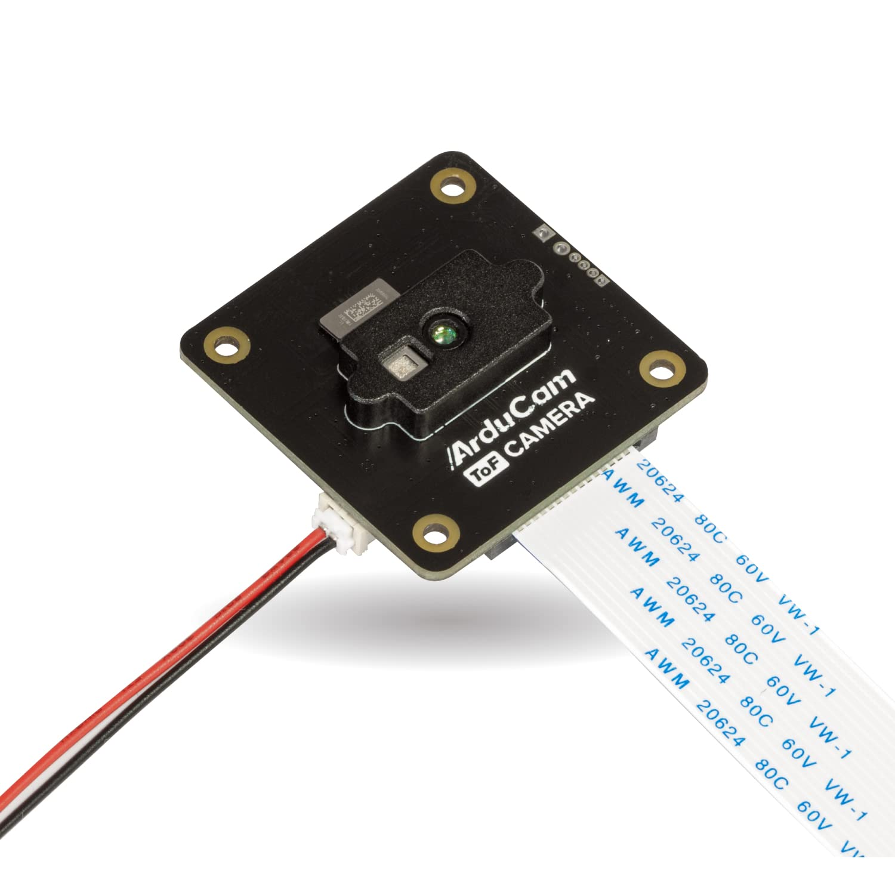
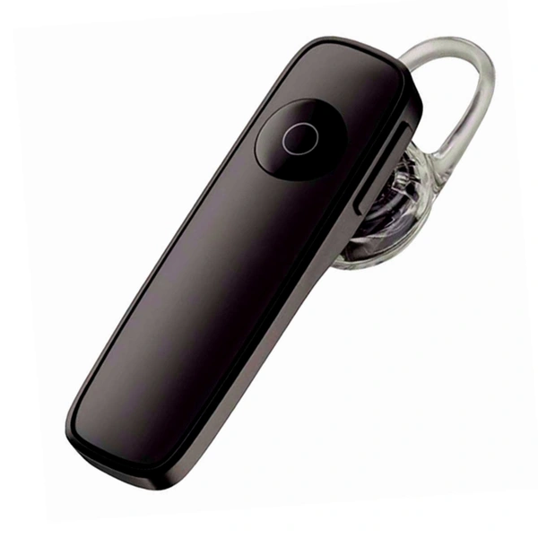

<!-- ─── SLIDE 1: Title ─────────────────────────────────── -->

# AI Smart Navigation Assistant for Visually Impaired People Using Raspberry Pi

## Smart Cane Environmental Awareness System

### IoT Term Project · First Draft Presentation

<br>

**Igor Xavier** &nbsp;·&nbsp; **Fang Jialuo**

---
<!-- class: default -->

<!-- ─── SLIDE 2: Objective ─────────────────────────────── -->
## A. Main Idea & Objective

**Problem:** Visually impaired users struggle to navigate indoor environments safely and independently, especially in unfamiliar spaces.

<div class="cols">

<div>

**Original vision — Visual SLAM**
Full indoor mapping using ORB-SLAM3 and ROS, building a 3D map in real time and navigating autonomously.

➡ Deprioritized: requires IMU, significant compute, and complex calibration beyond current scope.

</div>

<div>

**Revised scope — Awareness System**
Two focused functions that are achievable, reliable, and genuinely useful:

- 🔴 **Obstacle detection** via ToF depth camera
- 🔵 **Location recognition** via webcam + ORB features
- 🔊 **Audio feedback** via Bluetooth headphones

</div>
</div>

> *"Obstacle 0.8m ahead."* &nbsp;&nbsp; *"You are in the office."*

---

<!-- ─── SLIDE 3: System Design ─────────────────────────── -->
## B. System Design & Methodology

**Awareness loop at 2 Hz — fully offline, no cloud:**

```
Arducam ToF ──► Obstacle Detector ──────────────────────────────► Audio Alert
                (depth threshold,                                  (espeak-ng)
                 central zone only)

USB Webcam  ──► ORB Feature Matching ──► Confidence Score ──────► Announce
                (vs. stored descriptors    > threshold?             location
                 per trained location)
```

| | What | How | When |
|---|---|---|---|
| Obstacle | Depth < threshold in central zone | ToF frame | Every cycle |
| Location | ORB descriptors matched vs. training | Webcam frame | Every 3rd cycle |
| Audio | espeak-ng subprocess | Bluetooth headphones | On event |

---

<!-- ─── SLIDE 4: Assembled Hardware Photo ─────────────── -->
## D. Hardware — Assembled Prototype

<br>


---

<!-- ─── SLIDE 5: Hardware Components ──────────────────── -->
## D. Hardware Components

<div class="cols4">

<div class="card">
  
  <p><strong>Raspberry Pi 4</strong><br>Central compute<br>4GB RAM</p>
</div>

<div class="card">
  
  <p><strong>Arducam ToF B0410</strong><br>Depth sensing<br>CSI · up to 4m</p>
</div>

<div class="card">
  
  <p><strong>Logitech C270</strong><br>Location recognition<br>USB · 720p</p>
</div>

<div class="card">
  
  <p><strong>BT Headphones</strong><br>Audio output<br>A2DP · offline TTS</p>
</div>

</div>

<br>

| Component | Key Spec | Role |
|---|---|---|
| Raspberry Pi 4 (4GB) | ARM Cortex-A72 · 4GB LPDDR4 | Runs all processing locally |
| Arducam ToF B0410 | 240×180 · 10 FPS · 4m range | Forward obstacle depth |
| Logitech C270 | 640×480 · 30 FPS · UVC | ORB-based room recognition |
| Bluetooth Headphones | A2DP audio | espeak-ng TTS output |

---

<!-- ─── SLIDE 6: Code — Obstacle Detection ────────────── -->
## C. Code — Obstacle Detection

`src/nav_assistant/obstacle/detector.py`

```python
def check(self, tof_frame: ToFFrame) -> Optional[ObstacleAlert]:
    # Check only the central third of the frame (forward path)
    min_depth = tof_frame.forward_min_depth(zone_fraction=0.33)

    if min_depth > 0 and min_depth < self._threshold:
        now = time.monotonic()
        # Cooldown prevents repeated alerts for the same obstacle
        if now - self._last_alert_time >= self._cooldown:
            self._last_alert_time = now
            return ObstacleAlert(min_depth=min_depth, ...)

    return None
```

<div class="cols">

- Central **33% of the depth frame** = forward path only
- Threshold configurable in `config/default.yaml` (default: **1.2m**)
- **2s cooldown** between alerts for same obstacle

**Output examples:**
- *"Warning! Obstacle very close."* (< 0.5m)
- *"Obstacle ahead, 0.8 metres."*
- *"Obstacle detected ahead."*

</div>

---

<!-- ─── SLIDE 7: Code — Location Recognition ──────────── -->
## C. Code — Location Recognition

`src/nav_assistant/localization/place_recognizer.py`

```python
def recognize(self, gray_frame: np.ndarray) -> RecognitionResult:
    _, query_descs = self._orb.detectAndCompute(gray_frame, None)

    for waypoint, stored_descs in self._index:
        matches = self._matcher.knnMatch(query_descs, stored_descs, k=2)
        # Lowe's ratio test — keep only unambiguous matches
        good = [m for m, n in matches if m.distance < 0.75 * n.distance]
        if len(good) > best_good:
            best_good, best_wp = len(good), waypoint

    confidence = min(1.0, best_good / 250)
    return RecognitionResult(waypoint=best_wp, confidence=confidence, ...)
```

<div class="cols">

**Training data per location**
- 2-minute walk-around session
- 1 frame every 3 seconds → 40 frames
- 40 × 500 features → **5000 descriptors stored**

**Why ORB over deep learning?**
- Runs on CPU, no GPU needed
- No training data required
- Built into OpenCV

</div>

---

<!-- ─── SLIDE 8: Current Progress ─────────────────────── -->
## Current Progress

| Phase | Status | What was done |
|---|---|---|
| 1 — Sensor Integration | ✅ Complete | Webcam + ToF validated on RPi hardware |
| 2 — Location Training | ✅ Complete | 2 locations, 5000 descriptors each |
| 3 — Awareness Loop | 🔄 In Progress | Loop built and running, testing ongoing |
| 4 — Tuning & Polish | ⏳ Pending | Confidence and threshold tuning |

<br>

**Scripts running on hardware today:**

| Script | Purpose |
|---|---|
| `test_sensors.py` | Validates webcam + ToF connectivity |
| `train.py` | 2-min capture sessions, auto-detects cameras |
| `awareness.py` | Real-time obstacle + location feedback loop |

---

<!-- ─── SLIDE 9: Challenges & Solutions ───────────────── -->
## E. Challenges & Solutions

| Challenge | Solution |
|---|---|
| Webcam gets random `/dev/videoX` index across reboots | Parse `v4l2-ctl --list-devices` at startup, match by device name |
| Arducam SDK `DeviceType.TOF` doesn't exist in installed version | Use `FrameType.DEPTH` — discovered by reading official Python examples |
| `pyttsx3` crashes on Python 3.13 + espeak-ng | Call `espeak-ng` directly via `subprocess` — no TTS library needed |
| Webcam returns blank frames right after `open()` | Discard first 5 frames to allow UVC sensor warmup |
| Single training frame insufficient for reliable recognition | 2-minute continuous capture session (40 diverse frames per location) |

---

<!-- ─── SLIDE 10: Expected Output & Benefits ───────────── -->
## F. Expected Output & Benefits

<div class="cols">

<div>

**What the user hears:**

```
"Awareness system started."

"You are in the office."

"Obstacle ahead, 0.8 metres."

"You are in the hallway."

"Warning! Obstacle very close."
```

</div>

<div>

**Benefits:**

- **Offline** — works without internet in any indoor space
- **Low cost** — ~€80 total hardware
- **Real-time** — 2 Hz loop, < 500ms response
- **Wearable** — Bluetooth audio, cane form factor
- **Extensible** — architecture ready for navigation features

</div>
</div>

---

<!-- ─── SLIDE 11: Next Steps ───────────────────────────── -->
## G. Next Steps & Future Plan

<div class="cols">

<div>

**This week**
- End-to-end test of `awareness.py` on hardware
- Tune `confidence_threshold` and `alert_threshold_m`
- Train more locations in real environment

**Before submission**
- Startup/shutdown audio announcements
- CPU profiling and frame rate optimization
- Final demo recording

</div>

<div>

**Future work (post-submission)**

Originally planned as v1 — preserved as future roadmap:

- 🗺️ Visual SLAM / indoor map building
- 🧭 Route planning (Dijkstra on waypoint graph)
- 🦾 Turn-by-turn navigation instructions
- 📐 IMU dead-reckoning between locations
- 🤖 MobileNetV3 for richer scene recognition

</div>
</div>

---
<!-- class: lead -->

<!-- ─── SLIDE 12: Thank You ────────────────────────────── -->

# Thank You

## Smart Cane Environmental Awareness System

### *AI Smart Navigation Assistant for Visually Impaired People*

<br>

**Igor Xavier** &nbsp;·&nbsp; **Fang Jialuo**

<br>

🔗 `github.com/w1ggor/smart-nav-cane`

### Questions?
